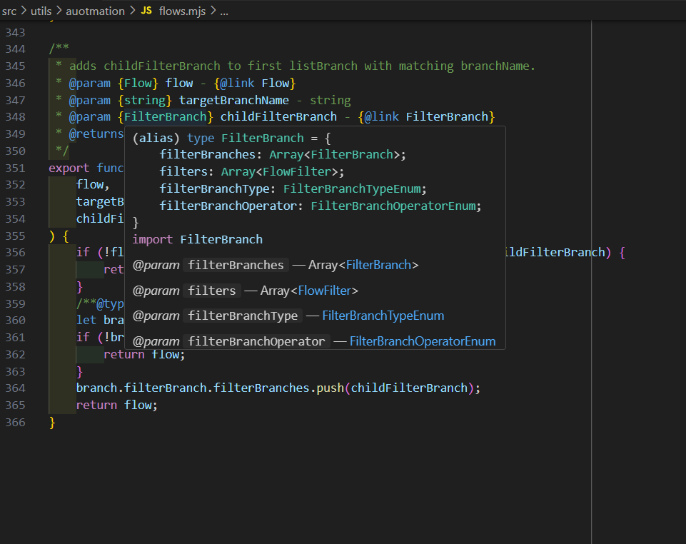
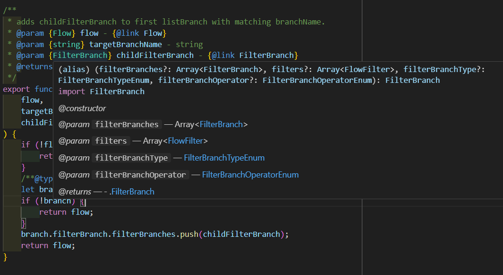
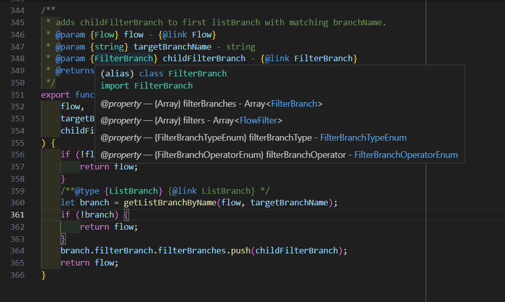
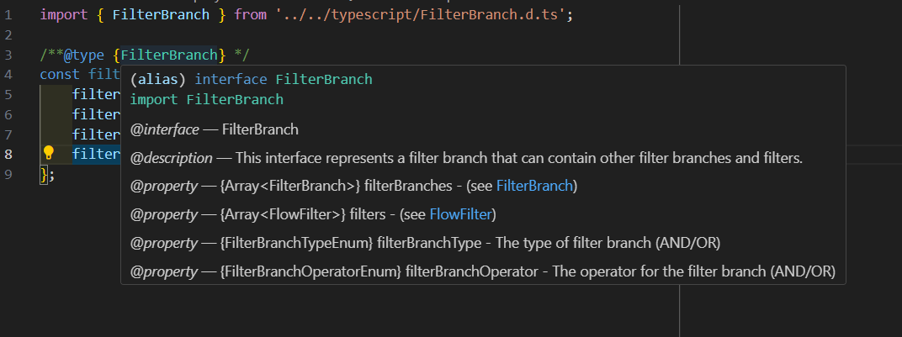

# Overview:
- A collection of scripts using the HubSpot API
-   https://developers.hubspot.com/docs/reference/api/overview
-   https://developers.hubspot.com/docs/reference/api/automation/create-manage-workflows

## Points of Interest:
### ./src/types/automation/, ./src/utils/automation/flows.mjs, ./src/WorkflowManager.mjs
- logic to retrieve and update HubSpot workflows
### ./src/utils/crm/ 
- logic to handle CRM objects (e.g. contacts, deals, line items)

--------
### ./type_hint_screenshots/: images examining how different type definition methods are translated to tooltips by VSCode. (e.g. using JSDoc comments and tags such as @typedef, using a factory function, using a class, and using typescript).

#### Option 1 - Javascript JSDoc Factory Function, Typedef

#### Option 2 - Javascript JSDoc Factory Function With Constructor Tag, Typedef

#### Option 3 - Javascript JSDoc Class Constructor, Typedef

#### Option 4 - Typescript Interface

#### Option 5 - Typescript Type (No picture. Results in similar if not identical tooltip as Option 1)
Essentially the same method as Option 3, but use the 'type' keyword instead of 'interface'
export interface ObjectName {
  prop1: string
}
->
export type ObjectName = {
  prop1: string
}

### Based on the appearance and usefulness of the tooltip, I prefer options 1 and 5. However, I think it's better practice to use interfaces.
